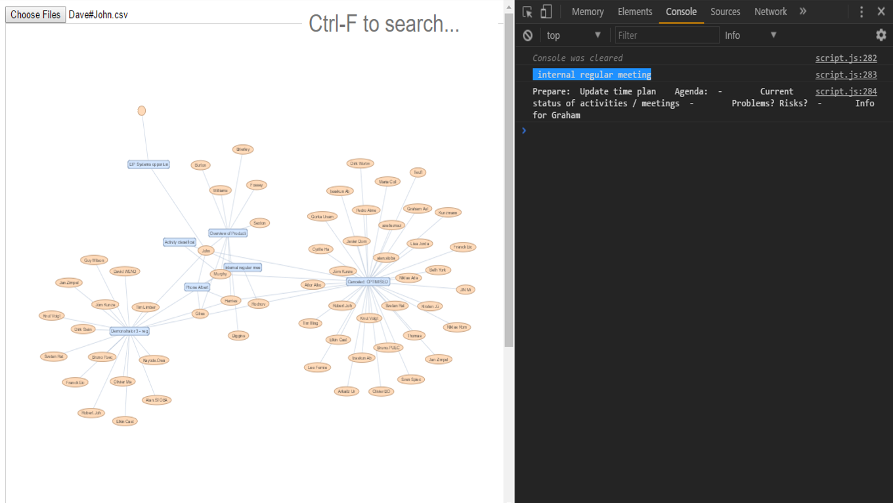

# CalendarVis app
#### https://antonivlev.github.io/calendar-vis/

to run locally, clone repo and go to: file:///C:/.../CalendarVis/index.html

</img>

Blue nodes are meetings, orange are people. Open dev console and mouse over nodes to see some node data.

To use:
- Get ics file from outlook
- Convert to csv here http://www.indigoblue.eu/ics2csv/ (this converter isn't great, should find a better one). Rename your file like: **firstname#surname.csv**
- Go to app url, open developer console
- Upload. Multiple files can be uploaded

----------------------------------------
Note:
- Searching nodes is slow. At the top of script.js integer UPTO can be used to reduce network graph size for faster searching. UPTO is used only on line 37 (populateNodesEdges(UPTO)).


Basic idea:
- populateCalendarData() converts csv files to array of structured js objects:
```javascript
	calendar_data = [
		{
			SUMMARY: "Meeting about the thing",
			DTSTART: Date,
			DTEND: Date,
			NOTES: "Agenda: 1. Talk about the thing  2. Drink tea  3....."
			ATTENDEE: ["Smith, Paul", "BeGoode, Johnny", ...]
		},
		...
	]
```
- populateNodesEdges() converts calendar_data to
```javascript
	node_list = [
		{id: (meeting summary), label: ..., color: ..., notes: (meeting notes), ...},
		...
		{id: (person name), label: ..., color: ..., ...},
		...
	];

	edge_list = [
		{from: (name node id), to: (meeting node id)},
		...
	];
```
- visualise() uses node_list and edge_list to draw the network
